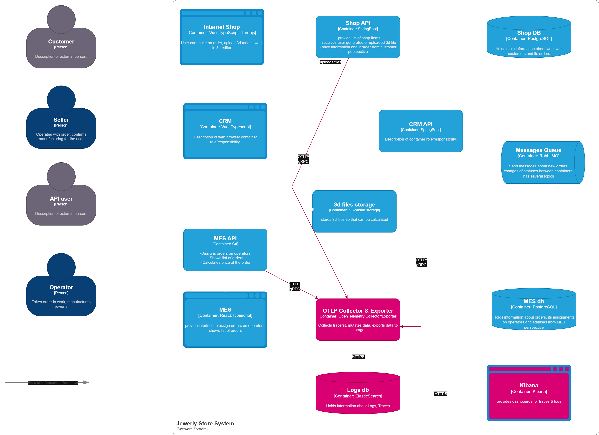

# Архитектурное решение по трейсингу «Александрит»

## Мотивация
В систему необходимо добавить трейсинг для диагностики существующих проблем.
> Заказы часто находятся в непонятном состоянии или зависают на каком-то сервисе; Проблемы с заказами могут появляться и вовсе только потому, что сообщения теряются.

При включении трассировки совокупное поведение системы перестанет быть черным ящиком.

Трассировка показывает:
- Какой сервис сколько времени работал 
- Где была задержка 
- Какие ошибки возникли

Наличие трассировки позволит обновить SLO и управлять такими метриками как:
- RPS (throughput)
- Response time (latency)
- Number of HTTP attemps

Трассировка позволит выявить узкие места в цепочке вызовов

## Предлагаемое решение

### Архитектура 

- В сервисы распределенной информационной системы встроить зависимость на OpenTelemetry SDK.
- В работу каждого котроллера встраивается запрос в OLTP Collector.
- На узле OLTP Collector добавляем роль экспорта данный в ElasticSearch
- Данные трассировки хранятся в ElasticSearch
- Визуализация, агрегация и алертинг событий трассировки реализован в Kibana

### Структура спанов

| поле                                          | назначение                                                                          |
| --------------------------------------------- | ----------------------------------------------------------------------------------- |
| `service.name`                                | Имя сервиса (`shop-api`, `crm-api`)                                                 |
| `span.kind`                                   | Тип: `SERVER`, `CLIENT`, `INTERNAL`                                                 |
| `error`                                       | Если произошла ошибка → `true`                                                      |
| `http.method`, `http.url`, `http.status_code` | Для HTTP-запросов                                                                   |
| **`trace_id`, `span_id`**                     | Связь между сервисами                                                               |
| **`operation.name`**                          | Что делало: `POST /orders`, `uploadFile`                                            |
| `tags`                                        | Метаданные: `user.id`, `order.id`, `file.type`                                      |
| `logs`                                        | Ошибки, события, шаги                                                               |
| `attributes`                                  | Дополнительные данные. Напр. `user.id`, `email`, `order.id`, `device.os`, `browser` |
### Безопасность

Для предотвращения несанкционированного доступа к системе трейсинга рекомендуется предусмотреть методы защиты данных
- **Шифрование трафика** при помощи mTLS для данных, передаваемых между компонентами системы
- RBAC контроль доступа с разделением ролей на чтение и запись
- Маскировка чувствительных данных на уровне OTel Collector

### Схема контейнеров

## Компромиссы
1. Внедрение вызовов OTel SDK в модули реализующие бизнес-логику создает негативный эффект на latency, т.к. при обработке запроса возникают дополнительные операции, такие как
	 - Создание span объекта
	 - Запись атрибутов
	 - Sampler decision
	 - Context propagation
	 - Export queueing
 2. Увеличивается издержки компании на обслуживание инфраструктуры приложения:
	- Вычислительные ресурсы для коллектора
	- Лицензии коммерческих решений
	- Обслуживание инфраструктуры
	- Обучение команды
3. Компромиссы sampling
	* Полные данные для отладки – Высокая стоимость хранения
	* Контролируемый объем данных – Можно пропустить редкие ошибки
	* Защита от перегрузки – Может пропустить пиковые нагрузки
