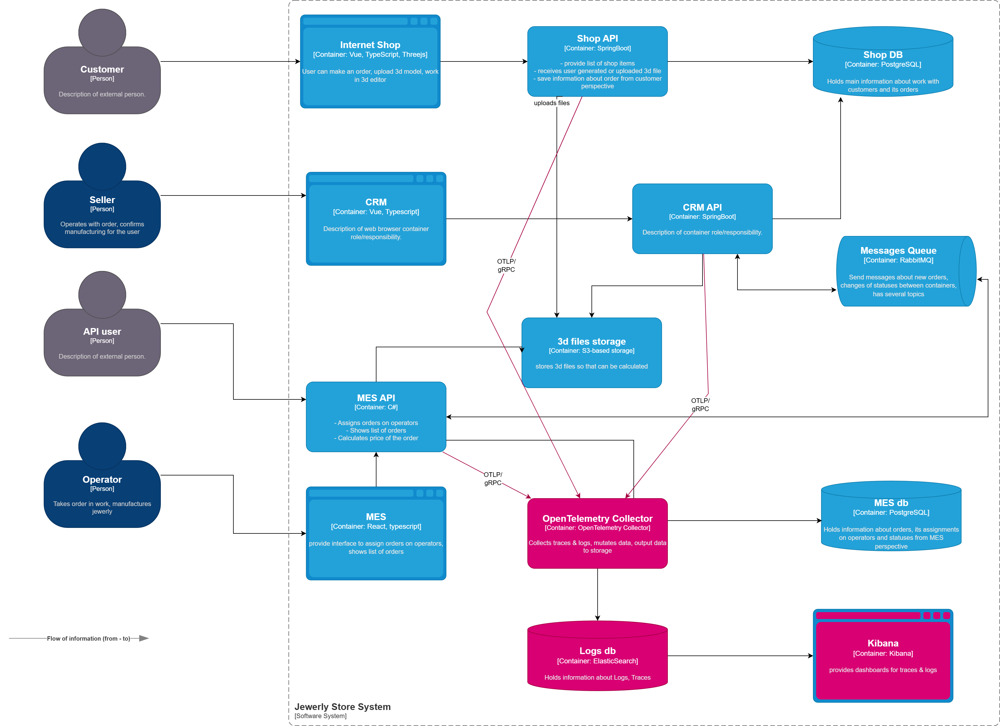

# Архитектурное решение по логированию

## Предлагаемое решение

С точки зрения стоимости внедрения и поддержки будет оптимальным совместить стек технологий трассировки и логирования.

Преимущества
1. Сбор логов происходит в структурированном формате OpenTelemetry Data Model. 
2. Корреляция логов с трейсами, что упрощает диагностику проблем.
3. Экспорт данных через OTLP (OpenTelemetry Protocol) в Elasticsearch.
4. Визуализация в Kibana



### События логирования 📝
* **Shop API**
	* `INFO`:
		* регистрация/изменение пользователя
		* отказ от покупки
		* оформление заказа
	* `ERROR`: все исключения
* **MES API**
	* `INFO`:
		* запрос расчета цены
		* регистрация/изменение пользователя
		* расчет цены
		* назначение заказа исполнителю
	* `ERROR`: все исключения
* **CRM API**
	* `INFO`
		* начало/конец моделирования
		* оформление заказа
		* оформление, начало доставки
		* вызов фильтра заказов
	* `ERROR`: все исключения

### Дашборды в Kibana 📊

#### Health Overview

```text
- Число ERROR/WARN/INFO за последний час
- График: RPS по каждому сервису
- Длина очереди RabbitMQ
- Время ответа (p95)
- Последние 10 ошибок
```

---

#### Shop API Overview

```text
- Число заказов в минуту
- Процент успешных / отменённых
- Карта: откуда заказы (по IP)
- Медленные операции: `checkout duration > 3s`
```

---

#### MES: Production Tracking

```text
- Число заказов запущенных производств
- Процент завершённых
- Среднее время изготовления
- Частые ошибки: `file format`, `access denied`
- Активность ювелиров
```

---

#### Security & Compliance Dashboard

```text
- Попытки входа (IP, user_id)
- Ошибки аутентификации
- Действия администраторов
- События удаления данных
- Все `trace_id` с `error=true`
```

---

#### Distributed Tracing Dashboard

```text
- Поиск по `trace_id`
- Полный путь запроса: `Shop → CRM → MES`
- Latency каждого шага
- Логи, привязанные к трейсу
```

---

### Алерты в Kibana 🔔

#### Алерты Shop API

| Алерт                    | Условие                                | Причина                          |
| ------------------------ | -------------------------------------- | -------------------------------- |
| `High Error Rate`        | `ERROR logs > 5/min`                   | Сбой при оплате, регистрации     |
| `Slow Page Load`         | `latency.p95 > 2s`                     | Пользователи уйдут               |
| `Failed Orders`          | `message:"order failed"` за 5 мин > 10 | Нужно срочное вмешательство      |
| `RabbitMQ Queue Backlog` | `queue_length > 100`                   | CRM/MES не успевают обрабатывать |

#### Алерты CRM API

| Алерт                   | Условие                             | Причина                         |
| ----------------------- | ----------------------------------- | ------------------------------- |
| `User Sync Failed`      | `"sync error" AND service:crm`      | Не все данные клиента актуальны |
| `Unauthorized Access`   | `status:401 OR "invalid token"`     | Подозрительные попытки входа    |
| `DB Connection Failure` | `"Could not connect to PostgreSQL"` | Критично для CRM                |

#### Алерты MES API

| Алерт                     | Условие                  | Причина                                    |
| ------------------------- | ------------------------ | ------------------------------------------ |
| `File Processing Error`   | `"failed to parse .glb"` | Проблема с 3D-файлом                       |
| `Long Manufacturing Time` | `duration > 5d`          | Статус готовности не меняется более 5 дней |

## Мотивация

Логирование – это «дневник» приложения, где фиксируются события, ошибки, действия пользователей и другие значимые факты.

Логирование является основным инструментом для
- **Диагностики ошибок**. Позволяет понять, что пошло не так, когда и почему возникла проблема.
- **Отладки приложения**. Упрощает поиск багов на этапе разработки, тестирования и эксплуатации

## Сравнение технологий

|                           | ELK                              | OpenSearch                            | Splunk                       |
| ------------------------- | -------------------------------- | ------------------------------------- | ---------------------------- |
| **Тип**                   | Open Source<br>SaaS              | Open Source<br>On-perm                | Proprietary<br>SaaS          |
| **Лицензия**              | SSPL                             | Apache 2.0 ✔                          | Проприетарная                |
| **Ядро поиска**           | Elasticsearch✔                   | OpenSearch                            | Splunk Engine                |
| **Сбор логов**            | Logstash, Filebeat, Fluentd✔     | Logstash, Filebeat, OpenSearch Agent✔ | Universal Forwarder, HEC     |
| **Визуализация**          | Kibana✔                          | OpenSearch Dashboards                 | Splunk Web UI                |
| **Поддержка трассировки** | Да                               | Да                                    | Да                           |
| **Масштабирование**       | 🟤🟤                             | 🟤🟤                                  | 🟤🟤🟤✔                      |
| **Производительность**    | 🟤🟤                             | 🟤🟤                                  | 🟤🟤🟤✔<br>big-data          |
| **Аналитика (ML)**        | ML Module – коммерческое решения | Встроенные ML-модели✔                 | Splunk ITSI, ES, SOAR✔       |
| **Безопасность**          | RBAC, Audit Logs, TLS            | RBAC, Audit Logs, TLS                 | Развитые: UBA, UEBA, SIEM    |
| **Цена**                  | Бесплатно✔                       | Бесплатно✔                            | Дорого, по объему данных     |
| **Управление затратами**  | ILM, Rollover, WARM/COLD tiers   | ILM, Rollover, WARM/COLD tiers        | Индексаторы, ретенция        |
| **Простота установки**    | 🈵🈴                             | 🈴✔                                   | 🈲🈵🈴                       |
| **Kubernetes ready**      | Да                               | Да                                    | Да                           |
| **Поиск по логам**        | Kibana Query Language            | Kibana Query Language                 | Search Processing Language   |
| **Кому подходит?**        | проекты среднего размера         | минимизация издержек                  | enterprise, fintech, govtech |
## Заключение

> ❌Логи без алертов → слепота девопсов.<br>
> ❌Алерты без дашбордов → паника разработчиков.<br>
> ✔ Дашборды + алерты → контроль над информационной системой.

*— Шарль Луи де Монтескьё, «Размышления о причинах величия», 1734 г.*
