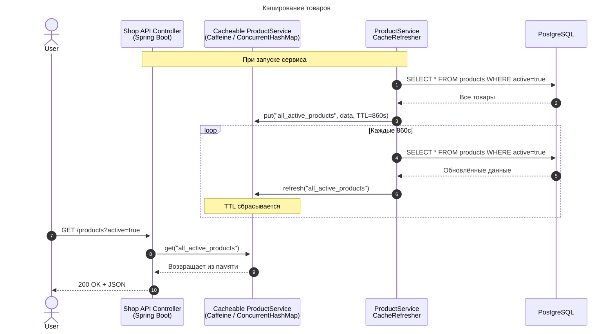
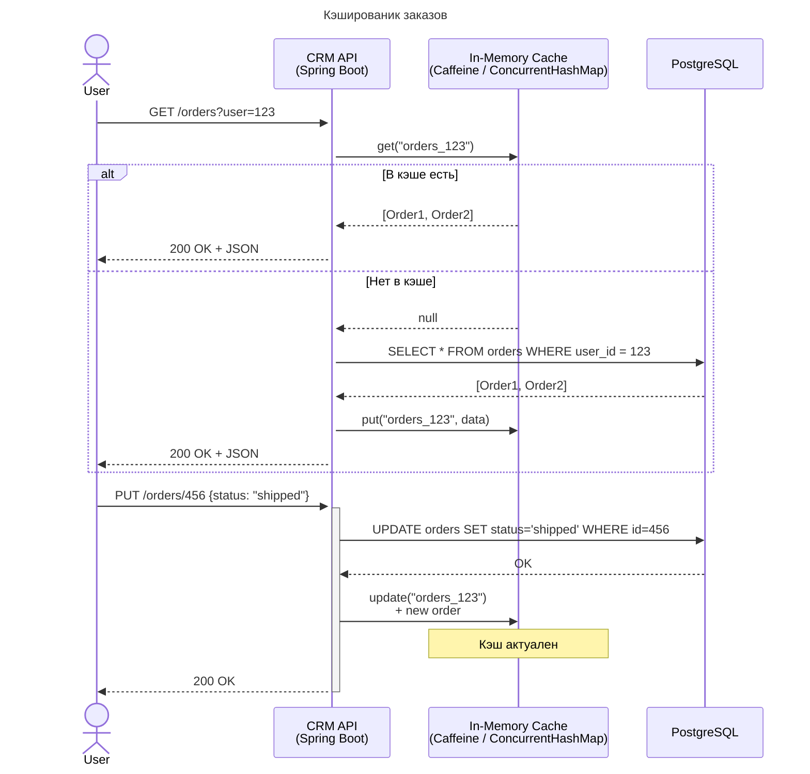

## Предлагаемое решение

Исходя из того, что по предварительной оценке наиболее нагруженными сервисами являются Shop API, CRM API рекомендовано внедрить кэширование на уровне этих сервисов.

### Кэширование Shop API

Предлагается внедрить In-memory кэш в службу выдачи списка товаров.

Особенности службы выдачи списка
* Обновляется редко
* Операций чтения много
* Устаревание данных в кэше на период до 900 секунд является некритичным

Способ организации кэширования:
* Чтение данных: Cache-ahead / Pre-fetching
* Изменение данных со стороны пользователей не предусмотрено
* Вытеснение устаревших данных кэша обеспечивается методом time-based invalidation c TTL=860 секунд.
* Предусмотрена ручная инвалидация для менеджеров магазина

**Последовательность работы кэша товаров Shop API**

### Кэширование CRM API

Предлагается внедрить In-memory кэш в службу выдачи списка заказов.

Особенности службы заказов
* Обновляется со средней частотой
* Операций чтения много
* Устаревание данных в кэше на период более 20 секунд является критическим

Кэширование в службах Списка заказов, Деталей заказа
* Чтение данных: Read-through
* Изменение данных: Write-through
* Trigger-based инвалидация и разогрев кэша

**Последовательность работы кэша заказов CRM API**

## Мотивация

Кэширование является мощным инструментом горизонтального масштабирования производительности системы.

Правильно настроенный механизм кэша приводи к
* **Уменьшению latency**, времени отклика системы
* **Снижению нагрузки** на медленные системы (БД, файловую систему)

Правильная настройка кэширования включает в себя методы чтения кэша, обновления кэшированных данных, а так же политику вытеснения(eviction) кэша.

### Cравнение решений паттернов кэширования

| паттерн                    | описание                                                                                                                                                                                                                                                                                                                |
|----------------------------|-------------------------------------------------------------------------------------------------------------------------------------------------------------------------------------------------------------------------------------------------------------------------------------------------------------------------|
| Read-through               | При запросе на чтение данных: - Если cache-miss → дата-сервис обращается в БД *Pros/Cons:* ✔ возвращаемые данные всегда актуальны ❌ производительность чтения зависит от качества настройки политики вытеснения кэша (cache eviction)                                                                       |
| Cache-ahead / Pre-fetching | При запросе на изменение данных: - Клиент всегда получает ответ только из кэша. - Если cache-miss → ошибка или null - Обновление данных кэша происходит автономно асинхронно. *Pros/Cons:* ❌ возвращаемые данные могут быть неактуальны ✔ производительность чтения высокая                           |
| Write-through              | Клиент дата-сервиса не знает о существовании кэша. При запросе на изменение данных: - Вначале меняется кэш, затем хранилище.  - Обновление данных происходит синхронно. *Pros/Cons:* ✔ данные в кэше и в БД всегда актуальны ❌ производительность записи низкая                                       |
| Write-behind / Write-back  | Клиент дата-сервиса не знает о существовании кэша. При запросе на изменение данных: - Вначале меняется только кэш.  - Обновление данных БД происходит автономно асинхронно. *Pros/Cons:* ❌ данные в БД могут быть неактуальны ✔ данные в кэше всегда актуальны ✔ производительность записи высокая |
| Write-around               | При запросе на изменение данных: - Вначале меняется только состояние БД.  - Обновление данных в кэше происходит автономно асинхронно. *Pros/Cons:* ✔ данные в БД всегда актуальны ❌ данные в кэше могут быть неактуальны ❌ производительность записи средняя                                          |

**Сравнение паттернов чтения кэша**

| паттерн                    | скорость чтения | гарантия согласованности |
| -------------------------- | --------------- | ------------------------ |
| Read-through               | 🐌              | ✔                        |
| Cache-ahead / Pre-fetching | 🐎🐎🐎          | ⭕                        |

**Сравнение паттернов обновления кэша**

| паттерн                   | скорость записи | гарантия актуальности кэша | гарантия актуальности данных |
| ------------------------- | --------------- | -------------------------- | ---------------------------- |
| Write-through             | 🐌              | ✔                          | ✔                            |
| Write-behind / Write-back | 🐎🐎🐎          | ✔                          | ⭕                            |
| Write-around              | 🐌🐌            | ⭕                          | ✔                            |
легенда:
* 🐎 – условная единица скорости обращения к памяти
* 🐌 – условная единица скорости обращения к системе хранения

**Вывод**

> Улитка медленнее коня, но конь делает больше ошибок.

*— Перикл, 439 г. до н. э.*

